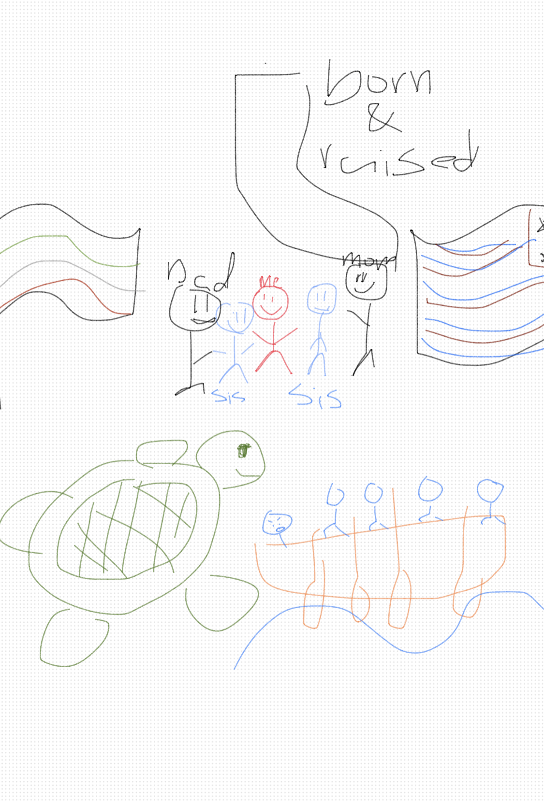

# Nora's Blog Homepage
### a little bit about me
hello! my name is Nora Ahadian! I am in period 3 CSSE.

i am a rower and an athlete at san diego rowing club located in mission bay!

my favorite animal is a turtle and I used to have one when I was younger!
 

# weeky updates!

| weeks  | struggles                                                                                                                                                                                                                  | learned                                                                                                                 | tangibles                               |
|--------|----------------------------------------------------------------------------------------------------------------------------------------------------------------------------------------------------------------------------|-------------------------------------------------------------------------------------------------------------------------|-----------------------------------------|
| week 1 | At first I strugled to learn to make a new repository and to clone that using "git clone".  Then I had strugles with commiting my changes as whenever I commited it would show an error on github.  To overcome these strugles I decided to take inisitive and look at the error on github and try to find a solution to my problem.  I also used my resources by asking fellow students or uperclassmen for their insight to find an awsner to my problem.| Cd means to change directory. "MKDIR" makes a new directory. Make creates a new server.  Make clean stops the currect server and resets it essentially cleaning the files. Ls stands for list which lists the current avalible directories.  The code to add an immage is "img src= image link..." but inside of <>| [my blog homepage!](http://0.0.0.0:4200/nora/) |
| week 2 |                                                                                                                                                                                                                            |                                                                                                                         |                                         |
| week 3 |                                                                                                                                                                                                                            |                                                                                                                         |                                         |

# Freeform Picture
all about me in one picture

